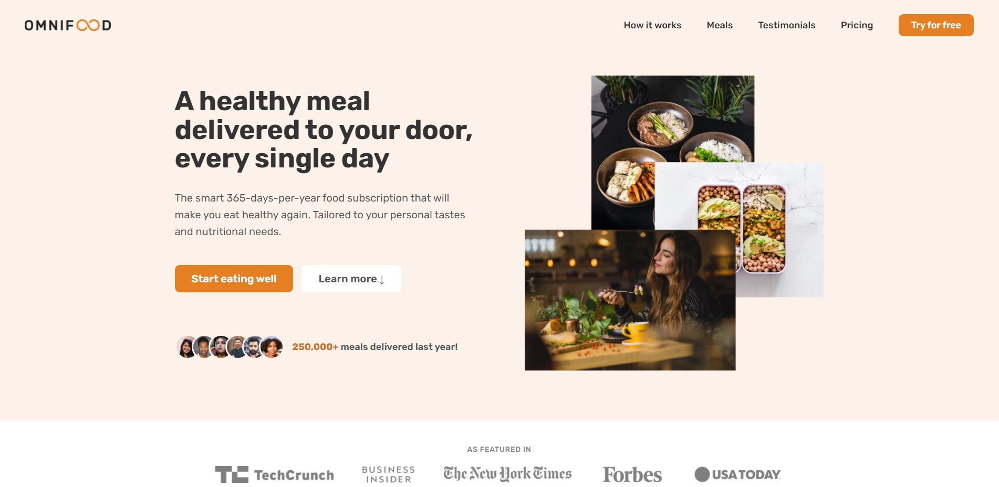

<h1 align="center">Omnifood</h1>



This is my result after course of html and css. Can you see [here](https://brunof14.github.io/omnifood/).

## In this course I learned about:

- Box-model
- Position
- Semantic Tags
- Pseudo-class
- pseudo-elements
- Flex-box
- Grid
- Media Queries
- SEO
- Image Optimization

---

## About learning

The learning for me was immense. Because there were certain behaviors when I was developing that I didn't understand or why they occurred.

for example:

```css
/* 

  not work of default <a> is display: inline;
  and elements inline no has effect define:
  
  - height
  - width
  - margin-top
  - margin-bottom
*/
a.btn {
  height: 32px;
  padding: 0.8rem;
  width: 100%;
}

/* work */
a.btn {
  display: block; /* or inline-block, flex, grid */
  height: 32px;
  padding: 0.8rem;
  width: 100%;
}

/* 
  how to box-model calculate width and height depends of type box-sizing defined by default box-content

  box-sizing: box-content

  width-real = padding-left + border-left + width + padding-right + border-right

  height-real = padding-top + border-top + height + border-bottom + padding-bottom
*/
.rectangle {
  box-sizing: content-box;
  width: 100px; /* width real 120 */
  height: 45px; /* height real 55 */
  padding: 5px 10px;
}

/* 
  flexbox why justify-content and align-items work differently depends on the main axis defined.
*/

/* how of 'hack' align elements to center with position absolute works */

/* selectors */
.box:last-child {
  margin-top: 2.5rem;
}

.box > .title {
  color: #777;
}

.box[title="lorem"] {
  color: pink;
}

/* and more */
```

Now with these basic (but important) concepts it has now become easier to develop.

---

But of course he didn't finish his studies. Never stop learn 🚀🚀🚀

**Thanks for watch ❤️**.
